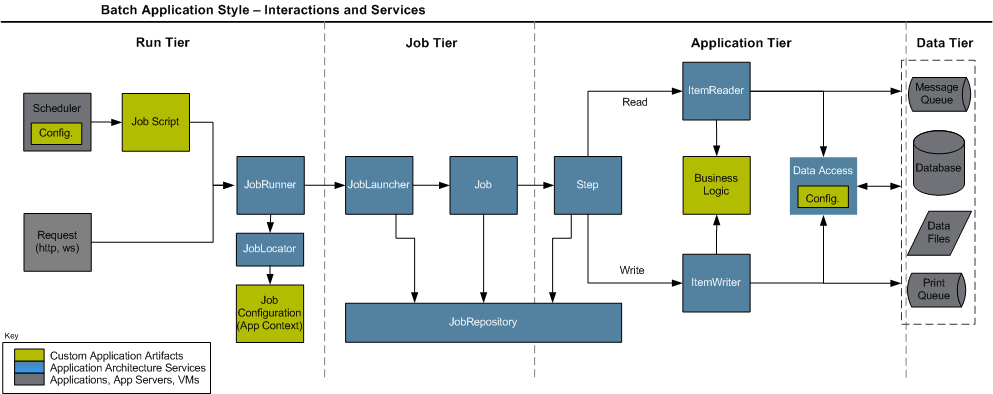

<div align="center" id="top"> 
  

&#xa0;

  <!-- <a href="https://springbatchdemo.netlify.app">Demo</a> -->
</div>
<!---->

<h1 align="center">Welcome to Spring Batch Demo repo 👋</h1>

<p align="center">
  

  

  

  


  <!--  -->

  <!--  -->

  <!--  -->
</p>

<!-- Status -->

<!-- <h4 align="center"> 
	🚧  Spring Batch Demo 🚀 Under construction...  🚧
</h4> 

<hr> -->

<p align="center">
  <a href="#dart-about">About</a> &#xa0; | &#xa0; 
  <a href="#sparkles-features">Features</a> &#xa0; | &#xa0;
  <a href="#rocket-technologies">Technologies</a> &#xa0; | &#xa0;
  <a href="#white_check_mark-requirements">Requirements</a> &#xa0; | &#xa0;
  <a href="#checkered_flag-starting">Starting</a> &#xa0; | &#xa0;
  <a href="#memo-license">License</a> &#xa0; | &#xa0;
  <a href="https://github.com/Abdelouahedd" target="_blank">Author</a>
</p>

<br>

## :dart: About ##

This repository is a small work to test how to process large data using spring batch.It contains implementation of how to read from file csv and process
the data and after write it into specific db (H2).
we can use multiple implementation for processing and writing into database (spring dat,jdbcBatchItemWriter,JdbcTemplate) 
## :sparkles: Features ##

:heavy_check_mark: Feature 1: Create a CRUD application to manage employees into database\
:heavy_check_mark: Feature 2: Create a configuration for spring batch to insert list of employees into database using csv file\
:heavy_check_mark: Feature 3: Test different implementation of ItemWriter and ItemProcessor;

## :rocket: Technologies ##

The following tools were used in this project:

- [Spring](https://spring.io/)
- [Maven](http://maven.apache.org/)
- [Java 11](https://www.java.com/)

## :white_check_mark: Requirements ##

Before starting :checkered_flag:, you need to have

- [Git](https://git-scm.com)
- [java 11](https://www.java.com/)
- [Maven](http://maven.apache.org/)
  installed.

## :checkered_flag: Starting ##

```bash
# Clone this project
$ git clone https://github.com/Abdelouahedd/spring-batch-demo

# Access
$ cd spring-batch-demo

# Install dependencies
$ mvn clean compile

# Run the project
$ mvn spring-boot:run

# The server will initialize in the <http://localhost:8080>
```

## ✨ Show your support

Give a ⭐️ if this project helped you!

## :memo: License ##

This project is under license from MIT. For more details, see the [LICENSE](LICENSE.md) file.

Made with :heart: by <a href="https://github.com/Abdelouahedd" target="_blank">👤 Abdelouahedd</a>

&#xa0;

<a href="#top">Back to top</a>
